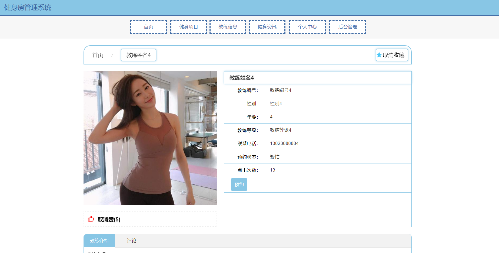
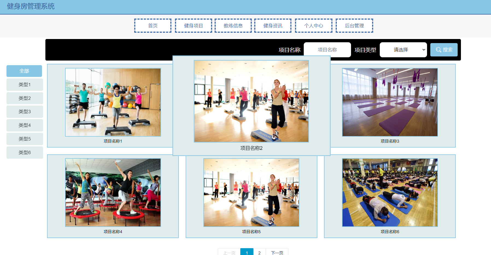
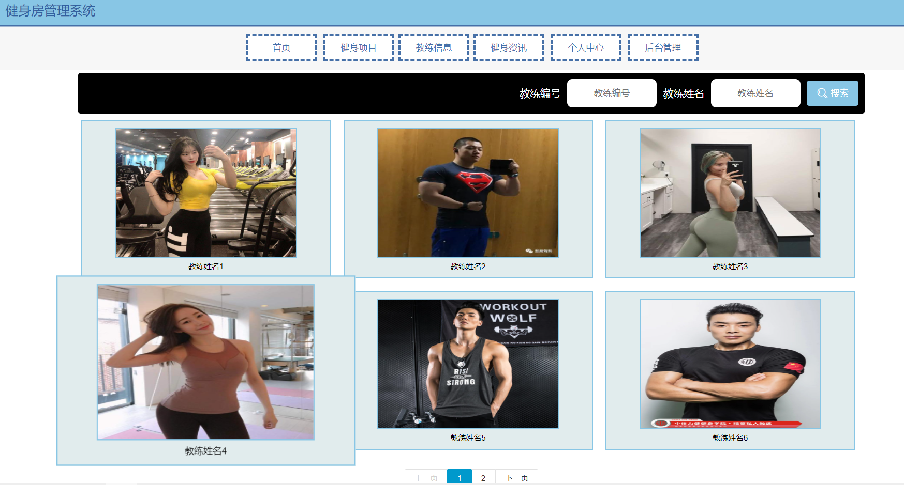
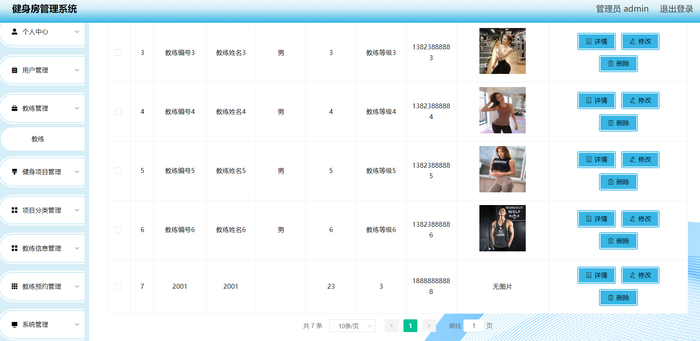
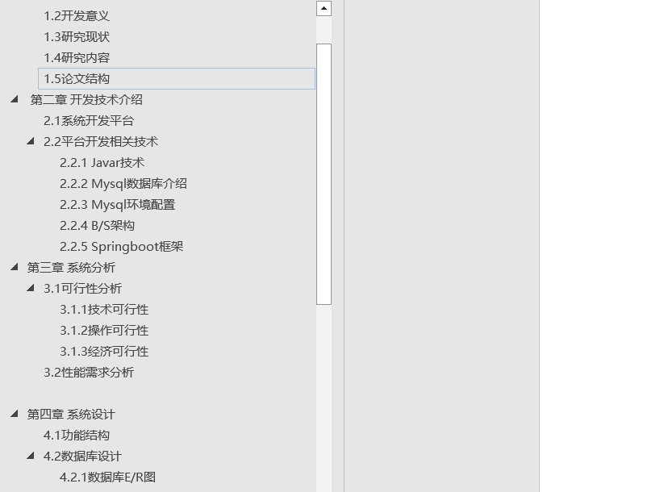
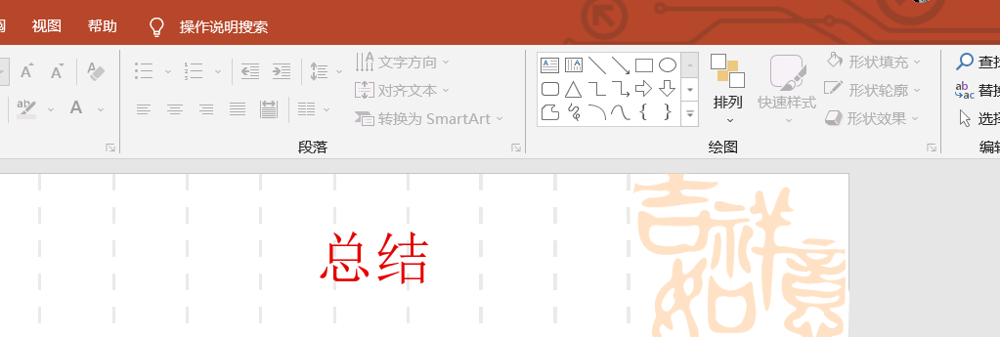

## 介绍

&emsp;&emsp;基于SpringBoot+**Vue**的健身房管理系统，健身房预约系统，教练预约，服务预约。

>- 
>
>- 开发语言：Java 
>- 数据库：MySQL 
>- 技术：SpringBoot+Vue+MyBatis 
>- 工具：IDEA/Ecilpse、Navicat、Maven 
>- 可以提供远程部署调试，附带PPT以及相关文档
>- **QQ:3270728362**
>- 

---

**角色**：管理员、用户、教练 

- 用户：用户登录进入系统可以对首页，预约，个人中心，教练预约管理等功能。 
- 教练：教练登录进入系统可以对首页，个人中心，教练信息管理，教练预约管理等功能。
- 管理员：管理员登录系统后，可以对首页、个人中心、用户管理、服务人员管理、服务信息管理、服务类型管理、服务预约管理、服务取消管理、服务分配管理、服务进度管理、评价信息管理、留言反馈、系统管理等功能进行相应的操作管理。

## 系统展示

**前台**

> 项目的按类查询，按类查询、按名称查询、多种查询。

>健身教练的展示。

>详情以及预约界面，可展示状态是否可以预约等。

**后台**

>教练信息的管理

## 相关文档

>相关文档PPT也是完整的，需要的可以联系我。

